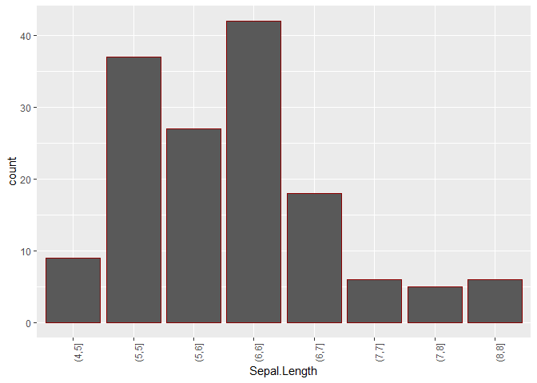

<!-- README.md is generated from README.Rmd. Please edit that file -->

# AnalyseR

<!-- badges: start -->

[](https://lifecycle.r-lib.org/articles/stages.html#experimental)
<!-- badges: end -->

L’objectif de l’application est de pouvoir comparer différents packages
de visualisations graphiques tels que `ggplot2` et `plotly`.

## Installation

Vous pouvez installer ce package de la façon suivante:

``` r
devtools::install_github("yanismicha/AnalyseR")
```

## Example

Pour charger le package il suffit d’écrire la commande suivante:

``` r
library(AnalyseR)
```

## Lancement de l’application

Pour lancer l’application, lancer ensuite la commande suivante:

``` r
AnalyseR::run_app()
```

Vous avez également accès à toute les fonctions utilisés à l’intérieur
de l’application.  
**Exemple**:

``` r
AnalyseR::histogramme(data=iris,variable = "Sepal.Length",nbClasses = 10,color = "darkred",type="ggplot")
```



``` r
AnalyseR::scinde(iris)
#> $quanti
#> [1] "Sepal.Length" "Sepal.Width"  "Petal.Length" "Petal.Width" 
#> 
#> $quali
#> [1] "Species"
#> 
#> $binaire
#> NULL
```
